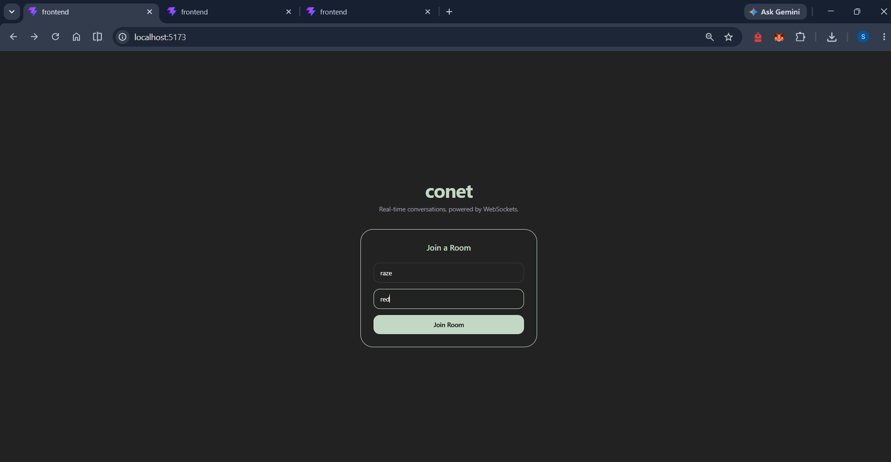
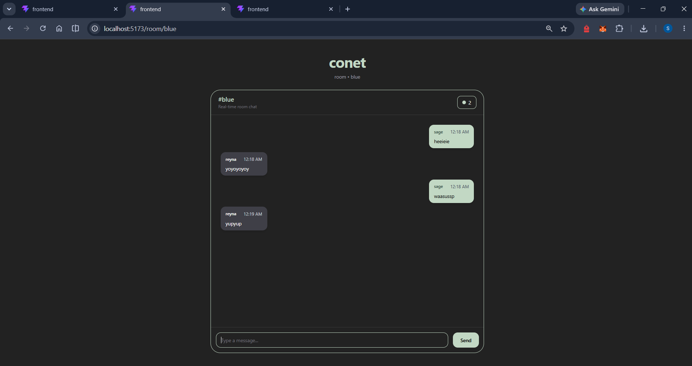

# Conet

Real-time room-based chat application powered by WebSockets and TypeScript.


## Screen shots

# join room


# Real-Time Conversation




## About

Conet is a real-time room-based chat application built with React, TypeScript, and WebSockets. Users can create or join chat rooms and exchange messages instantly through persistent WebSocket connections. The project focuses on low-latency communication, scalable room management, and a clean modern user experience.

## Tech Stack

- Frontend: React, TypeScript, Tailwind CSS
- Backend: Node.js, WebSocket (ws)
- Communication: Real-time WebSocket connections
- Architecture: Room-based messaging system

## Features

- Real-time messaging between connected clients
- Room creation and joining
- Lightweight, easy-to-extend starter for auth and persistence

## Repository structure
conet
│
├── backend
│   ├── src
│   ├── package.json
│   └── tsconfig.json
│
├── frontend
│   ├── src
│   ├── public
│   ├── package.json
│   └── vite.config.ts
│
├── screenshots
│   ├── conversation.png
│   ├── join-room.png
│
│
└── README.md


## Prerequisites

- Node.js 16+ and npm (or yarn/pnpm)

## Quick start

Open two terminals (one for backend, one for frontend).

Backend

```powershell
cd backend
npm install
npm run dev
```

Frontend

```powershell
cd frontend
npm install
npm run dev
```

If the `dev` script is not defined, try `npm start` or consult the package.json in each folder.

## Build

Backend (if applicable)

```powershell
cd backend
npm run build
npm start
```

Frontend

```powershell
cd frontend
npm run build
npm run preview
```

## Contributing

Contributions are welcome. Create an issue or open a PR describing the change.


